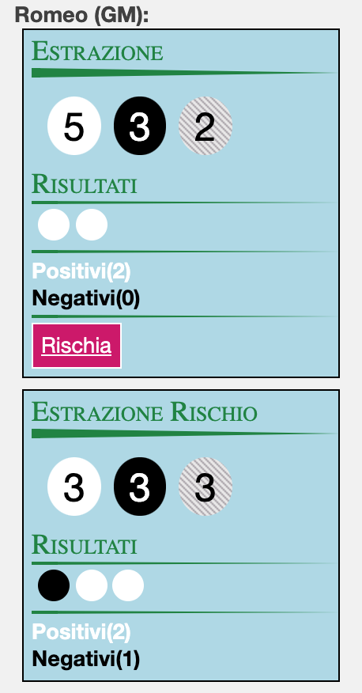

# Not The End Roll20

Commands
**!nte 3 3 2**  normal draw  !nte {positive} {negatives} {draw_tokens}
**!nte c 3 3 2**  confusion draw  !nte {positive} {negatives} {draw_tokens}
**!nte-createMacro** creation of 2 macros for normal draw and confusion

Per utilizzare il comando passare tutti i valori neccesari
es. **!nte 3 3 2** il primo numero sono i token positivi, il secondo i token negativi
ed il terzo il numero di token da estrarre.
Una volta effettuata un estrazione clickando su rischio viene effetuato estrazione per arrivare a 5 token 
estratti dal pool di token iniziale.

E' possibile usare anche il comando **!nte-createMacro** 
per creare una macro che gestisce con dei popup per i dati in input  estrazione dei token.
Una volta lanciato il commando, succesivi lanci non crerano la macro per poterla ricreare bisogna cancellare 
la macro generata la prima volta.  

